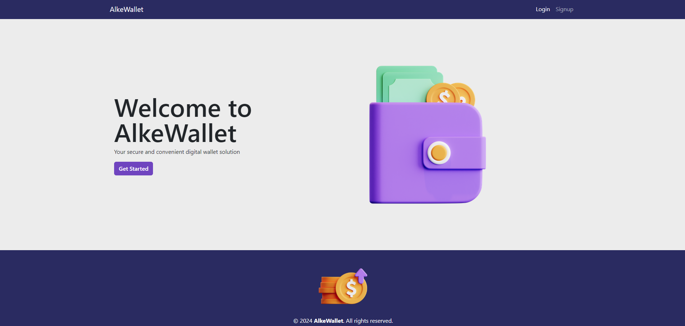
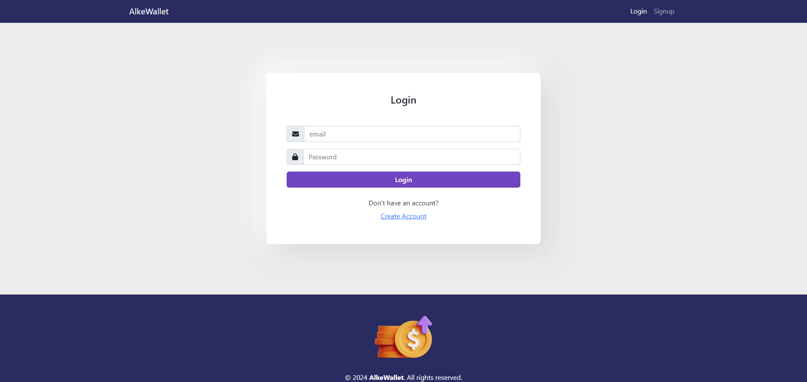
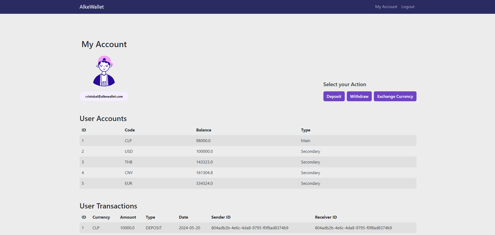
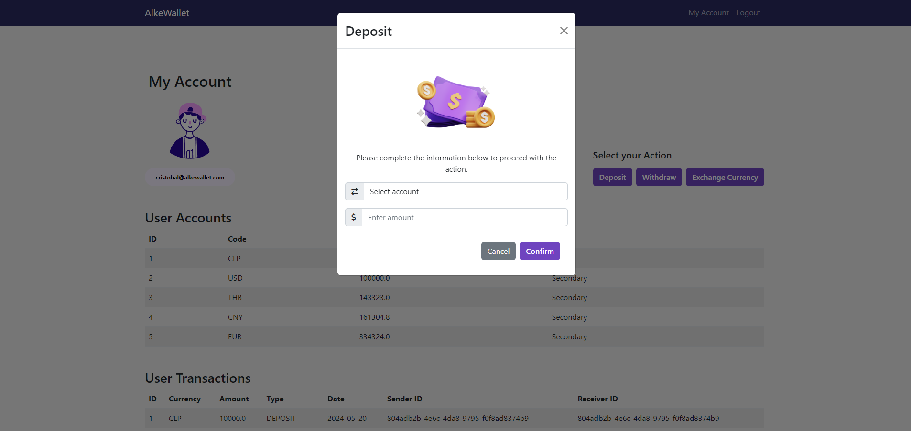

# Alkewallet M5

Alkewallet M5 es una aplicación de gestión financiera diseñada para brindar a los usuarios una plataforma segura y eficiente para administrar sus finanzas personales.

## Características Principales

- **Autenticación de Usuarios**: Los usuarios pueden iniciar sesión de manera segura utilizando su dirección de correo electrónico y contraseña.
- **Creación de Cuentas**: Los usuarios tienen la capacidad de crear nuevas cuentas dentro de la aplicación, lo que les permite organizar sus finanzas de manera más efectiva.
- **Depósitos y Retiros**: La aplicación permite a los usuarios realizar depósitos y retiros de fondos en sus cuentas, facilitando el manejo de sus activos financieros.
- **Intercambio de Moneda**: Con la opción de intercambio de moneda, los usuarios pueden convertir entre diferentes monedas utilizando tasas de cambio predefinidas, lo que les permite realizar transacciones en monedas extranjeras de manera conveniente.
- **Historial de Transacciones**: Los usuarios tienen acceso a un historial detallado de todas las transacciones realizadas, lo que les brinda una visión completa de sus actividades financieras.

## Tecnologías Utilizadas

- **Java**: Lenguaje de programación utilizado para desarrollar la lógica de negocio de la aplicación.
- **PostgreSQL**: Sistema de gestión de bases de datos utilizado para almacenar y gestionar los datos de los usuarios y las transacciones.
- **Servlets**: Componentes de Java utilizados para crear aplicaciones web dinámicas.
- **HTML/CSS**: Lenguajes de marcado y estilo utilizados para diseñar y maquetar la interfaz de usuario.
- **DAO (Data Access Object)**: Patrón de diseño utilizado para separar la lógica de negocio de la lógica de acceso a datos, garantizando un código limpio y mantenible.

## Instalación y Uso

1. Clona el repositorio desde [GitHub](https://github.com/tu_usuario/alkewallet).
2. Configura tu entorno de desarrollo Java y PostgreSQL.
3. Importa el proyecto en tu IDE favorito.
4. Configura la conexión a la base de datos en `DatabaseConnection.java`.
5. Ejecuta la aplicación y accede a través de tu navegador web.

## Capturas de Pantalla

